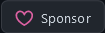

<!--
**hxr404/hxr404** is a ✨ _special_ ✨ repository because its `README.md` (this file) appears on your GitHub profile.

Here are some ideas to get you started:

- 🔭 I’m currently working on ...
- 🌱 I’m currently learning ...
- 👯 I’m looking to collaborate on ...
- 🤔 I’m looking for help with ...
- 💬 Ask me about ...
- 📫 How to reach me: ...
- 😄 Pronouns: ...
- ⚡ Fun fact: ...
-->
<h1 align="center">Hi 👋, I'm hxr404</h1>

<p align="left">  </p>

This profile page is still a WIP so please be lenient ;)


<!--
Accounts:
Twitter: hxr404
Instagram: hxr404_official
Facebook: hxr404
GitHub: hxr404
dev.to: hxr404
Matrix: hxr404:matrix.org
Youtube: youtube.com/channel/ucxvbruipmcsptbx_r1g2kfg
Reddit: u/hxr404
Vimeo: hxr404
diaspora: hxr404@societas.online 
tumblr: hxr404
twitch (currently diabled): hxr404
Medium: hxr404
-->

</p>


### Support Me

There are  many ways how to contribute to my projects (see [CONTRIBUTE.md](CONTRIBUTE.md))<br>

But I also put lots of time, effort and money into my work, so I really appreciate Donations.


<details>
  <summary>Here's how you can donate:</summary>

You can either make a one-time donation or become a patron (=monthly/yearly donator) and as a thank you receive some benefits.
There are multiple ways how to donate, I set up accounts on different platforms for your convenience.<br>
Monero, GitHub Sponsors and liberapay are the preferred ones, allthough others are available aswell.

  
|Name              |one-time donations|recurring donations|patron benefits|fees                |privacy     |Link                                                                                                                                                                                       |
|------------------|------------------|-------------------|---------------|--------------------|------------|-------------------------------------------------------------------------------------------------------------------------------------------------------------------------------------------|
|Monero            |       ✔️         |   (✔️) manually    |     ✔️        |✔️ none              |✔️✔️excellent| see below                                                                                                                                                                                |
|Github Sponsors   |       ✔️         |         ✔️         |     ✔️        |✔️ none              |OK          |<a href="https://github.com/sponsors/hxr404"></a>                                                                                           |
|Liberapay         |       ❌         |         ✔️         |      ❌       |✔️ none              |✔️good       |<a href="https://liberapay.com/hxr404/donate"></a>                                                |
|KoFi              |       ✔️         |         ✔️         |       ✔️      |⚠️ only for recurring|⚠️ acceptable|<a href="https://ko-fi.com/E1E35SXAO"></a>                                                                              |
|buy me a coffe    |       ✔️         |        ❌          |       ✔️      |⚠️ medium            |⛔ bad       |<a href="https://www.buymeacoffee.com/hxr404" target="_blank"></a>|
|Patreon           |       ❌         |         ✔️         |       ✔️      |⛔ high              |⛔ bad       |<a href="https://patreon.org/hxr404"></a>      |
<details>
  <summary>Cryptocurrencies</summary>
  If you want to donate using Monero, send XMR equivalent to the desired amount * the current exchange rate.<br>
  Example: Tier III patronage costs 10€. Current XMR price: 205.89. = You send 0.0485696 XMR to my wallet addres.<br>
  Here's the address:<br>
  </img><br>
  <em>If you can't / don't want to scan the QR Code: ```monero:889sJKy5Ag2TGeJkU1hFtNHd9d4knsaVzjJcZDSgVeixZY2hnRPVFaNB876SBjkjpBS3gJe1U7x24YiChq6h7wdjGKLXmLj```</em>
  <br>
  In case you want to donate with another crypto e.g. Bitcoin you'll have to use an exchange. The are many good exchanges that offer monero.
  <br>If you can't find any good echange, this might be useful: https://www.getmonero.org/community/merchants/.
</details>

If nothing seems good for you, contact me and we'll find a way to handle your donation.

</details>


## some widgets that apparently everyone has on their GitHub Profile

[](https://github.com/anuraghazra/github-readme-stats)


<a href="https://github.com/ryo-ma/github-profile-trophy"></a>


